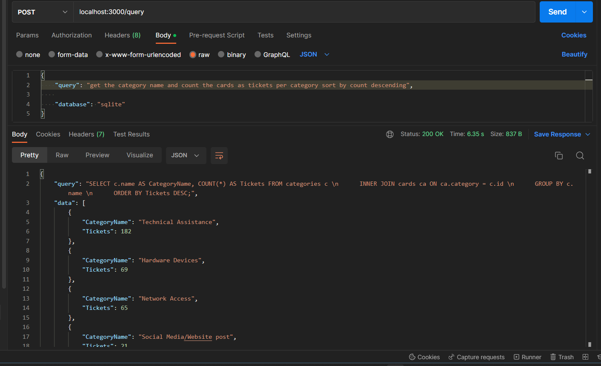

# sequel.AI - Natural Language to SQL Conversion App Documentation



This application is designed to convert natural language queries into SQL queries, and then execute those SQL queries on a specific database. This document will explain how to use the sequelAIze.js library, configure the database connection, and modify the application to work with other database engines.

[facebook.com/Trinwhocode](https://www.facebook.com/Trinwhocode)  
[linkedin.com/in/trinmar](https://www.linkedin.com/in/trinmar)

## Using the sequelAIze.js Library

The sequelAIze.js library exports a single function, `sequelAIze(prompt)`. This function takes a natural language prompt as its only argument, and returns a Promise that resolves to an object with two properties: `query` and `data`.

Here's an example of how to use the `sequelAIze` function:


```javascript
const { sequelAIze } = require('./sequelAIze');


const prompt = 'Show me all the customers from Los Angeles';
sequelAIze(prompt).then(result => {
  console.log(result);
}).catch(error => {
  console.error(error);
});
``` 

This example will execute the natural language prompt, generate an appropriate SQL query, and execute that query on the SQLite database. The resulting data will be returned in the `data` property of the object, and the SQL query will be returned in the `query` property.

## Configuring the Database Connection

The application is configured to connect to a SQLite database by default. To configure the database connection, you will need to modify the `database.js` file to use the appropriate database driver for your database engine.

Here's an example of how to modify `database.js` to use MySQL instead of SQLite:

javascriptCopy code

```javascript// Import the MySQL module
const mysql = require('mysql');

// Create a connection pool
const pool = mysql.createPool({
  host: 'localhost',
  user: 'your_username',
  password: 'your_password',
  database: 'your_database'
});

/**
 * Executes an asynchronous SQL query
 * 
 * @param {String} query The SQL query string to execute
 * @param {Array} data An optional array of data values to pass into the query
 * @returns {Promise<Array>} A promise that resolves with the resulting rows if the query is successful, or rejects with an error if it fails
 */
async function asyncQuery(query, data = []) {
  return await new Promise((resolve, reject) => {
    // Get a connection from the pool
    pool.getConnection((error, connection) => {
      if (error) {
        reject(error);
      } else {
        // Execute the query using the connection
        connection.query(query, data, (error, rows) => {
          // Release the connection back to the pool
          connection.release();
          if (error) {
            reject(error);
          } else {
            resolve(rows);
          }
        });
      }
    });
  });
}

// Export the asyncQuery function
module.exports = {
  asyncQuery
}
``` 

This example uses the `mysql` package to create a connection pool and execute SQL queries. You will need to modify the `host`, `user`, `password`, and `database` properties of the configuration object to match your MySQL database.